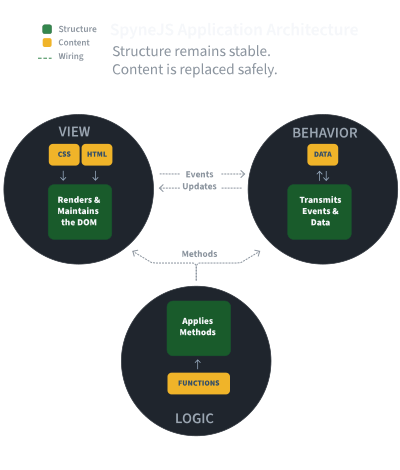

# code-noisemap

**Noise** is the avoidable ambiguity an agent must resolve when deciding what to implement, how code fits in the application, and where code and content belong.

This noise diminishes accuracy, control, context, and integration of applications, so reducing and eliminating it is key to unlocking AI capabilities.

### Why noise matters when models keep getting better

Models get better at working through noise. They do not make it go away, because the noise
is in the code, not in the model. An ambiguous choice about where something belongs is
resolved by every session that meets it, and a resolution is a choice. Nothing guarantees
two sessions make it the same way.

* **Capability does not converge on one answer.** In the benchmark behind SpyneJS, the same
  models given no rules produced 344 violations across 435 attempts, and given rules
  produced 19. The models did not change between arms. What changed was whether there was
  one right answer to find. A higher-reasoning arm at baseline still produced 52 violations
  in 45 attempts; more reasoning finds a plausible way, rules make one way the right one.
* **Noise is paid on every generation.** A model reads the working set before it can
  change a module safely, and spends reasoning on which of several placements to pick.
  Every agent pays it, every session, every task. A better model makes each payment
  smaller. It does not make it stop, and as one agent becomes many the multiplier compounds.
* **The cost moves to verification, which capability does not lower.** Someone has to
  check what the model wrote, and a reviewer can check by pattern only when there is a
  pattern. Where each session resolved the ambiguity its own way, review is line by line,
  by a person or by a judge model facing the same ambiguity. That cost rises with the
  volume models produce.
* **Noise is generative.** Models continue the style of what they read, so mixed code
  begets mixed code, and the next model trains on a corpus that includes it. A corpus does
  not converge by itself. It has to be given a shape to converge on.

"Models will handle it" proves too much. It is the argument against types, against linting,
against any structure, and nobody dropped TypeScript because models got better. They kept
it because it makes the model's output checkable. Rules for where things belong are types
for architecture: they do not make the model smarter, they make what it did verifiable and
repeatable, which are the two things capability cannot supply.

The benchmark is documented at [relevantcontext.io/spynejs/deck](https://relevantcontext.io/spynejs/deck).

### What clean means



Clean, for an agent, means it can read the application and immediately tell structure from
content: it knows where each of the four things belongs, it can write structure knowing the
content will not be affected and write content knowing the structure will not, and different
agents from different services work from the same grammar while their priors stay free to
fill the content. Structure remains stable. Content is replaced safely.

In SpyneJS that line is drawn by the framework. A ViewStream carries only its wiring surface,
the constructor, `broadcastEvents`, `addActionListeners`, and `onRendered`; a Channel carries
its registrations and its `onRegistered` wiring; the methods that respond live in SpyneTraits;
templates admit bindings and sections and nothing else. Reading the structure needs the
framework's grammar. Reading the content needs only priors, plus how trait methods are named
and the small parsing grammar of the templates. That is a claim any reader can test: point the
tool at a codebase and see whether its modules declare a shape and keep to it. We would welcome
a better definition of clean, because we would want to build it in.

### Who this is for

The map is meaningful only to a reader who accepts two premises, and it matters only to a
reader who takes one claim seriously. They are stated here so that a disagreement is about
the premises and not about the numbers.

The first premise is that every web experience can be expressed in three layers: View, what
draws and maintains a section of the page; Behavior, what listens and emits; and Logic, what
computes. A game is a canvas with a module that maintains it, behavior that captures the user
and the device, and its logic. A collaborative editor is the same. We would welcome a browser
experience that cannot be expressed this way, and have not found one.

The second premise is that a consistent structure, separated from content, is desirable in
software development, and above all in frontend web production, where content means markup,
copy, styles, and data formats, and structure is the three layers that draw, listen, and
compute. A reader who holds that the markup inside a component is structure is rejecting this
premise, not the classifier, and that is where the argument belongs.

The claim is that ambiguous and inconsistent mixing of the three layers lowers an
application's ability to provide context and verification, and makes its output less precise
to the intent behind it, because every new request has to be fitted into uniquely shaped
modules. The tool does not argue for the two premises; the case for the claim is the section
on why noise matters, and evidence for or against it is what the tool exists to gather.

We welcome alternative views and insights, with the goal of achieving better ways of
building web applications.

### SpyneJS Bias

#### What this tool measures

SpyneJS is organized on the VBL pattern, View, Behavior, and Logic, with content kept apart
from structure. The four buckets are those three layers plus the content they carry, and every
counted token of every codebase measured so far has landed in one of the four with nothing left
over. The tool measures whether an application declares those layers, and how cleanly it keeps
them apart.

The rule the scores apply follows from that: a token is categorized by the declared structure
it sits in first, and by what it does second. SpyneJS reads as clean because its VBLC modules
are clearly defined as such, and any non-configuration content inside them, a
`sendInfoToChannel` call, a payload filter used as a limiting function, `props.data` content
or a lambda, can be understood, read, and written by agents and developers knowing its
context within the module. React modules do not declare the sanctioned member surface this
policy recognizes; the adapter infers their roles from JSX and exports. The by-operation
figure beside the headline recomputes mixing with four mechanisms off, the member and export
seals, the trait absorption, and the host inheritance, so a reader who rejects the premise
can see what the numbers do without them.

`noisemap` is opinionated. Its four buckets and the separation they measure began as the ideas behind **SpyneJS**, a framework that incorporates two decades of enterprise software architecture specifically to eliminate structural noise. The tool is not a SpyneJS package, though. The supported adapters share the classifier and publish their framework-specific mappings and exceptions, and the first published run puts SpyneJS and React side by side, drift included. The config mechanism is how a Vue or Angular adapter would be added; none ships yet.

Critiques, challenges, and enhancements are welcome. The goal is to build a shared consensus on what constitutes noise—and establish standard practices for removing it.

### How It Works

`noisemap` runs two analyses over a frontend codebase.

**Shape** classifies every token into one of four buckets per module: **View**, **Behavior**, **Logic**, or **Content**, and evaluates:

* **Module Mixing:** How heavily concerns are blended within a single file.
* **Codebase Consistency:** How predictably patterns repeat across the project.
* **Structural Drift:** How far modules with declared roles deviate from their intended architectural shape.

**Wiring** follows every recognized connection site it can trace to its definition, marks
the rest unknown, and reports:

* **Vocabulary:** Every name the app speaks, with who emits it and who listens.
* **Working Set:** The counted modules and tokens in a module's one-hop neighborhood, under the connections the tool can trace.
* **Locality:** How far apart the pieces of a feature sit.

**Output:** A terminal summary, two JSON contracts (`noisemap.json` and `noisemap.wiring.json`), and a self-contained interactive HTML map with a tab for each.

`noisemap` is a pure measurement instrument. It sets no thresholds, enforces no rules, and passes no judgment. It simply reports the signal.

### Shape and Wiring

The map has two tabs, named for the definition's clauses.

**Shape**<br>This is where code belongs. Separation and consistent placement increase the legibility and evolvability of applications.

Every module is a brick with four faces. View is what draws and maintains a section of the
page: composing views, touching the DOM, registering listeners. Behavior is what listens and
emits. Logic is what computes, and includes the operations a trait performs for its host,
since the trait is the framework's function module. Content is what is shown: markup, copy, and styles, whether
they sit in a template file or in a JSX return. A value handed to a module as data takes the
data rule whether or not it is formatted: configuration in a view, logic in a trait. A clean brick is one color. A
codebase of same-shaped bricks is easy to build with, even when the shape is mixed, because
an agent or a newcomer learns the shape once. A pile of random shapes is not. Mixing,
consistency, and drift say how clean the bricks are and whether each kind of module holds
one shape. The map draws each module as a 10×10 grid of 100 blocks, its tokens by
percentage in the order they appear in the file, so a brick reads like its module.

**Wiring**<br>This is how code fits. Every declared connection the tool can trace is followed to its definition, and the rest are marked unknown, so an agent can see the names the app speaks, the counted size of a module's one-hop neighborhood, and how far apart the pieces of a feature sit.

A listener row is followed to the trait method it names, an action to the channel that
registers it, a template's keys to the data its view declares, a handler prop through the
parents that pass it to the function that runs, a dispatched type to its reducer case, a
route literal to its page file. From those connections come the **vocabulary**, the
**working set**, and **locality**. Unresolved connections are listed as findings, never
folded into a score, and wiring the analyzer cannot model is marked unknown rather than
counted either way.

What neither tab measures: *what to implement*. Intent, what the app is for and why, is not
capturable statically; sequence, what happens in what order, is deferred.

## The fairness test

**The same rule gives the same bucket in every config.** A token is categorized by the
declared structure it sits in first, and by what it does second, and both halves apply to
every framework the same way. Inside a structure a framework declares and enforces, a
ViewStream's wiring members, a Channel's registrations, a trait's `prefix$` methods, a
React hook's or Route Handler's exported function, a token is the structure's type, and only
an operation of another layer shows. Where nothing is declared, every token is read by what
it does. Registering a listener through the framework's own surface is View in both
(`onClick={…}` in JSX, `broadcastEvents` in SpyneJS), and `addEventListener` is Behavior in
both; the body that runs on the event is Behavior in both. Content is a format: markup and
its text, whether in a template file or a JSX return, styles, JSON, Markdown. A string
literal in code is code, in both frameworks: a label in a view's configuration is View, a
message in a utility is Logic. When a rule seems to favor one framework, that is a bug in
the rule, and every rule is data you can dispute (see **Configs** below).

## Install and run

```
npx code-noisemap ./src                     # Shape: terminal table + writes noisemap.json
npx code-noisemap map ./src                 # Shape + Wiring: writes noisemap.json and noisemap.html, opens the map
npx code-noisemap wiring ./src              # Wiring: vocabulary and findings + writes noisemap.wiring.json
npx code-noisemap ./src --json              # JSON to stdout only
npx code-noisemap ./src --framework react   # override detection
npx code-noisemap explain ./src/App.tsx     # one file, one span per line, to dispute a call
npx code-noisemap explain ./src/App.tsx --wiring ./src   # …plus its connections and measures
```

The package is `code-noisemap`; the installed command is `noisemap`, so after
`npm install -g code-noisemap` the examples above read `noisemap ./src`.

Detection reads the nearest `package.json`: `react` selects the React config, `spyne` or a
`@spynejs/*` package selects the SpyneJS config. Routing is per file: `.jsx`, `.tsx`, and
`.mdx` are always React; a plain `.js`/`.ts` that extends a SpyneJS role class is SpyneJS in
any codebase; other plain files follow detection; `.scss`, `.css`, `.less`, `.html`, `.md`,
and `.txt` go to the Content adapter. Test code (`test/`, `tests/`, `__tests__/`,
`__mocks__/`, `*.test.*`, `*.spec.*`) is left out unless `--include-tests` is given.

`map` accepts `--no-open`, `--no-source`, and `--no-wiring`. By default the map embeds each
module's source so a click shows the file with every token colored by bucket, and runs the
wiring so the Wiring tab is there. Shape tiles draw composition by default, every token in its
own bucket color on every side. A second view, declared shape, draws a module with a declared
role wearing its own color for every token inside that shape or permitted there, another
color only where a token is out of place, and a member the role does not sanction out of
place in full and hatched; a module with no role recognized by the adapter shows its
composition there too. The Wiring tab has the summary tiles, a chart of
connections by kind and status, a donut of modules by working-set size (both click to
filter), the vocabulary and module lists, and a path strip for any one connection. The map
is one HTML file with no external requests: plain SVG built from strings, vanilla JS, light
and dark.

## What a token is

A lexical token: an identifier, keyword, literal, or word of prose. Whitespace is never a
token. Punctuation, comments, and scaffolding are tokens attributed to `excluded` and enter
no score, so a formatter run cannot move a score. Scaffolding is imports, export keywords,
function and class signatures, `super()` calls, decorators, and type annotations. Only
bodies count. Prose in a JSX child, a template, or a `.html` file is counted by word, the
same way in every adapter, and so is a class list: `class="flex h-10 items-center"` is three
Content tokens in a template and in JSX, the way `.card { padding: 16px }` is three in a
stylesheet. A string literal in code is one token and takes its context: Content is a
format, not a word count.

## The three scores

**Mixing**, per module. With `s_b` the share of counted tokens in bucket `b`:

```
mixing = 1 − max(s_V, s_B, s_L, s_C)
```

0 means one bucket; 0.75 is the ceiling (four equal buckets).

**Consistency**, per codebase. A module's *family* is its dominant bucket. With `m_f` the
component-wise median share vector of family `f`, and `‖·‖` the Euclidean distance in the
four-dimensional share space:

```
consistency = mean over modules of ‖ shares(module) − m_family(module) ‖
```

0 means every kind of module has one shape, whether that is four clean shapes or one shared
mixed shape; `√2` is the ceiling. A family of one module is its own median and is left out;
with no family of two, the score is null. It is unweighted: a 40-token module and a
4,000-token module count the same, because an agent reads modules one at a time. The headline
mean mixing is over **code modules**, everything but stylesheets, so the score does not depend
on how a framework files its styles: 65 SCSS modules at zero mixing would otherwise pull an
unweighted mean down against a codebase that puts its classes on its elements. The mean over
all modules and the token-weighted mean are reported beside it, labeled, and so is the mean
**by operation**: the same code modules read with the four structural mechanisms off, no
sanctioned-member sealing, no trait absorption, no export sealing, no host inheritance for a
payload filter or a transmit. What stays on, and the third review named each: a role's default
color for its class body, bare delegation to a trait, the role's own call rules, the
conditional allowances inside listener tables, and the recognition of data handed to a
rendering surface. It is a sensitivity figure, not a reading free of the taxonomy, and every
module carries its own value in the JSON. Mixing measures composition, not noise: a
template that is markup and copy is a two-color brick with nothing out of place, and a
component that is markup, computation, and listeners is a four-color brick. The map shows
which colors, and **logic in rendering** counts the Logic tokens that sit inside markup,
which is the mixing the definition means.

**Drift**, per module with a declared role. With `E` the role's expected buckets and `p` the
tokens the config permits outside `E` (for example trait calls in a SpyneJS Channel):

```
drift = (max(0, tokens outside E − p) + tokens in members outside the surface) / counted tokens
```

A SpyneJS `ViewStream` expects View and Content, not Behavior: its listener table, its
broadcast table, and its own `sendInfoToChannel` are View, and a `getChannel`, a `subscribe`,
or an `addEventListener` inside it is out of place. A `DomElement` expects View and Content;
a `Channel` Behavior; a `SpyneTrait` Logic alone. A trait is the framework's function module,
written for a ViewStream or a Channel, and what it does for that host is its function: in a
view trait, addressing the DOM through `el$`, composing a view, transmitting; in a channel
trait, reading payloads, subscribing, fetching. Those operations are Logic inside it. The
other layer's operation stays foreign: a channel trait manipulating the DOM, a view trait
subscribing to a stream or adding a listener, is out of place. A content format written into
a trait is foreign there; data the trait receives in a payload or assigns to the view's
`props.data`, literal or not, is its logic, because an agent does not go into a trait to
change a template, a stylesheet, or JSON. A React module is a view by
definition, since React is a UI library: a module that renders expects View and Content; a
module with no markup whose exports are `use*` hooks is the module that captures events or
data, and expects Behavior; a module exporting `GET`, `POST`, or another HTTP method is a
Route Handler, which listens for requests, and expects Behavior. In a hook or a route the
exported function is the module's type in full, as a sanctioned member is in a class. A
reducer or a utility declares nothing and gets no drift.

What a role's declaration covers is ruled as follows (2026-09-29): a module that is VBL
structure is its type, and anything inside it that is a property defining that type stays
that type. Inside a ViewStream's sanctioned members, the constructor, `broadcastEvents`,
`addActionListeners`, and `onRendered`, a default, a ternary, a trait call, a payload filter,
or a local call that feeds a property is the view's configuration, View. Only an explicit
operation of another layer keeps its own bucket there: a DOM query in a channel, a fetch in
a view, a console call. Inside a trait there is no other layer to keep: the trait exists to
do the host's DOM and channel work, so what it does for the host is its function (2026-09-29).
`sendInfoToChannel` is an internal method of ViewStream and takes its host, View in a view,
Logic in a trait. A member outside the sanctioned
surface, a method of its own on a ViewStream, is out of place in full, whatever its tokens
do: that is where significant logic in the wrong place shows, which is the noise the
definition means, not a conditional in a config. A `prefix$` call from a designated member is
the host's own whether the trait is bound through `props.traits` or used as a pure static
function; a call to a method no trait defines is named in the report, not counted as noise.
The same mechanism
will give Angular's `@Component`, `@Injectable`, and `@Pipe` drift scores without touching
the core.

## The declared-shape counts

Beside the scores, Shape reports what the Grammar claims, as counts. A module with a declared
role is **inside its shape** when every counted token sits in a bucket the role expects, or is
permitted there by a rule (a trait call in a Channel). It is
**on its surface** when it defines no member the role does not sanction: for a ViewStream the
constructor, `broadcastEvents`, `addActionListeners`, and `onRendered`; for a Channel the
constructor, `onRegistered`, `addRegisteredActions`, and `onViewStreamInfo`; for a SpyneTrait
the constructor and its `prefix$` methods. A React view or hook declares no member surface,
so it is inside its shape or not, and the tool lists the hooks it calls and handlers it
defines as its internal surface and counts how many distinct surfaces there are. That count
is an inventory, not a score: different features can legitimately need different hooks. It is
there so "every module its own shape" is a number and not a slogan.

```
insideShape      = declared modules with drift 0
onSurface        = declared modules whose members are all sanctioned
internalSurfaces = distinct internal surfaces among modules that declare none
```

## The Wiring measures

A **connection site** is any place the code hands control or data to something named
elsewhere: a call's callee, a handler passed on, an action dispatched, a channel or template
key named, a prop passed to a child, an import. A site is `declared` when the target is a
literal or a plain name, `opaque` when it is computed: `obj[name]`, a spread, a value read
from a context or a store, a call result used as a name. An **edge** joins a declared site to
the definition it names, with a status: `resolved`, `unresolved`, `ambiguous` (more than one
definition), or `external` (a package, the framework, a file outside the analyzed root).

```
discernibility   = declared sites / (declared + opaque sites)
resolution       = resolved edges / (resolved + unresolved + ambiguous edges)
vocabulary share = named sites / (named sites + handler sites)
working set      = the module + every module a resolved edge connects it to, either direction,
                   one hop (count, and Shape's counted tokens when available; counterparts
                   Shape did not count are reported as uncounted, never as zero)
locality         = mean directory distance from a module to its counterparts
```

Discernibility and resolution are kept apart and never multiplied: a codebase does not get
cleaner wiring by hiding it, it gets a lower discernibility. Edges marked `external` (a
package) or `unknown` (internal wiring the analyzer cannot model) are in neither ratio.
Named sites are listener rows, channels, dispatches, template keys, contexts, and store
reads; handler sites are functions passed by hand; vocabulary share is a distribution of
connection styles, not a score, and a plainly named `onClick={save}` counts on the handler
side. Working set is the one-hop read an agent must have available to change a module, in
counted tokens, which are not a model's context tokens. None of these is combined into a
single number.

## Output

`noisemap.json` (Shape) is the contract, documented in
[docs/json-contract.md](docs/json-contract.md) and validated by
[packages/core/schema/noisemap-output.schema.json](packages/core/schema/noisemap-output.schema.json).
`noisemap.wiring.json` (Wiring) is a second contract, documented in
[docs/wiring-contract.md](docs/wiring-contract.md) and validated by
[packages/wiring/schema/noisemap-wiring.schema.json](packages/wiring/schema/noisemap-wiring.schema.json).
The terminal output and the HTML map are renderers over the two, joined by module path, and
so can yours be. Every Shape module carries its raw counts, its shares, and its spans: source
ranges labeled with the bucket and the rule that assigned them, so any classification can be
disputed against specific tokens. Every Wiring edge carries both ends, its hops, and its
status, so any connection can be disputed the same way.

## Configs

Every rule is data. The built-in configs live in [packages/configs](packages/configs) as JSON
validated by [schema.json](packages/configs/schema.json). A `noisemap.config.json` in the
analyzed repo, in any parent directory of the target, overrides or extends them with the same
schema, keyed by framework id: a classifier with the same `id` replaces the built-in one, a
new `id` is appended.

### The Open Questions convention

Each config carries an `openQuestions` section listing its contestable calls, one line each:
the rule, what the config decided, and why. A call is contestable when a reasonable reader
could bucket the token differently. To dispute one, copy the config, change the call, run
both, and open a pull request with the two outputs. The convention exists so the instrument's
opinions are visible and versioned, not buried in code.

### Adding a framework

1. Add `packages/configs/<framework>.json` against `schema.json`: detection (dependencies,
   extensions, `extends` names), the default bucket, scaffolding kinds, classifiers, roles
   with expected shapes, and Open Questions.
2. Add `packages/adapters/<framework>` implementing the `Adapter` interface from
   `@noisemap/core`: `match(file, context, config)` and `analyze(file, config)`. A JavaScript
   framework can reuse `@noisemap/js-classify` wholesale, as React and SpyneJS do; the
   config then does all the work. Templates in their own language need a tokenizer that
   yields the same kind of token, so the counts stay comparable.
3. Register the adapter in the CLI's routing order and the config in `packages/configs`.
4. Run it against a public codebase and commit the terminal output as a sample.

## Samples

Under [samples/](samples/), one folder per codebase with the terminal tables, both JSON
files, the HTML map with both tabs, the vocabulary as a glossary (`VOCABULARY.md`), and, for
React, the handler paths (`HANDLER-PATHS.md`). Three are pairs: the Acme dashboard (Next.js
and SpyneJS, the same app built twice), React's own tic-tac-toe tutorial and its SpyneJS
twin, and TodoMVC's React implementation beside the SpyneJS todo example, which is not
feature-equivalent and is labeled so in the samples README. The alpha project
is the demonstrative case for Wiring: a codebase whose Shape is already clean, so the
vocabulary and the working set are what is left to read. The other SpyneJS examples from
spynejs.com have maps of their own. The Acme SpyneJS folder also carries a dispute set of
`explain` outputs with the calls worth arguing. The Next.js Acme map includes the app's server-side code under
`app/`; the SpyneJS map is frontend only. That asymmetry is known and left for a later
comparison. `scripts/build-samples.sh` rebuilds every sample from a neutral root.

## The fairness review

On 2026-09-27 an independent model (GPT-6 Astra) audited the instrument against the
private working history, reproduced both Acme reports, ran counterexamples, and reported
that the comparison was not fair enough to stand as evidence about frameworks. Every
finding was verified and every one led to a change. The corrections, and what they did to
the Acme pair:

| change | Acme SpyneJS mean mixing | Acme Next.js mean mixing |
|---|---:|---:|
| as published in 0.1.1 (JSX View, templates Content, SpyneTrait sealed) | 0.023 | 0.227 |
| SpyneTrait seal off, everything else as published (the review's own run) | 0.060 | 0.227 |
| all seals off, markup Content in both, fetch Behavior, sections not logic | 0.067 | 0.182 |
| the same, with the framework's own DOM API (`el$`) recognized as View | 0.076 | 0.182 |
| the same, with data handed to a rendering surface (`props.data`, object-literal props) as configuration in both | 0.067 | **0.185** |
| the same, with a payload filter taking its host's bucket: wiring in a view, logic in a trait, subscription in a channel | 0.053 | 0.185 |
| the same, with a string in code taking its context: Content is a format, not a word count | 0.052 | 0.182 |
| the same, with class lists counted one token per class in JSX and templates, as stylesheets already are | 0.052 | 0.169 |
| the headline at that revision: the same rules, mean over code modules only (stylesheets left out) | **0.076** | **0.172** |
| the same, with JSX back to View for comparison | | 0.230 |

The seal was hiding channel emission and DOM work inside traits, and the tool's DOM rule had
never heard of `el$`, so the view work in 19 trait files read as Logic until the Grammar's
`address-region-by-el$` card was read and the rule fixed. Copy declared as a view's data is
its configuration, in both frameworks, so a login form's default labels are View in a
SpyneJS constructor and in a React object-literal prop alike, while copy inside markup stays
Content in both. A `ChannelPayloadFilter` is a method that returns a boolean, so it is
whatever its host is: the view's wiring inside a listener table, a trait's logic, a channel's
subscription. And a string literal in code is code: a label in a view's configuration is
View, a message in a utility is Logic, in both frameworks, while markup, templates, styles,
and JSON are Content because they are content formats. Markup as Content moves
Next.js down, not up, because its JSX tags and text merge into one bucket; the mixing that
remains in a Next.js component is Logic and Behavior inside its markup. Logic in rendering
for Acme Next.js is 250 tokens; the SpyneJS templates report 0 by grammar, since a template
section iterates and cannot evaluate. Consistency for Acme SpyneJS moved from 0.03 to 0.09,
for Next.js from 0.23 to 0.21.

The other corrections: template keys are verified against the data the view declares, and
a binding whose data comes from the caller is `unknown` rather than resolved (29 of the 30
Acme SpyneJS bindings); selectors need the real relationship, not a part somewhere;
elements supplied by child views are `unknown`, not `external`; counterparts Shape did not
count are reported as uncounted rather than added as zero (27 in Acme SpyneJS, 9 in Acme
Next.js); a family of one module no longer scores a free zero in consistency; a trait call
is permitted only when the method exists on a trait; copy in attributes tokenizes by word in
both lexers; a console string inside an effect is Logic; the tic-tac-toe SpyneJS sample,
which was the todo app under the wrong name, is gone, and the todo pair is labeled as not
feature-equivalent. The review's probe files live under `fixtures/fairness-probes` with a
test that holds each correction in place.

### The second review

The same reviewing model was sent the corrected instrument with the record of every ruling.
Its verdict stayed "not fair" for the published comparison, while calling the tool close to
a useful diagnostic with caveats; it confirmed the
seals were gone by rerunning its own overrides, and it reported that several corrections
narrowed the gap rather than widening it. It also found what was still wrong, and the
changes that followed:

- A payload filter's structure takes its host, but an explicit operation written inside a
  predicate, a `fetch` or a `console` call, keeps its own classification.
- A trait call was verified against the traits its host actually binds. The third review
  showed that check read raw text and misfired both ways, and the ruling that followed
  removed the gate: see "The third review".
- A block-bodied `.map` callback inside JSX classifies its statements by what they do.
- JSON files are Content, as the README said and the adapter did not do; tooling manifests
  are not the application and are skipped.
- An absent template section key is not a missing binding, by the engine's own semantics;
  only value keys are required.
- A handler path that ends at a hook result is `unknown`, unsupported tracing, not
  demonstrated absence, with its reason on the edge.
- Labels say what is measured: non-stylesheet modules, action-style against handler-style
  sites, counted tokens in the one-hop neighborhood, an inventory of internal surfaces.
- Composition is the default tile view on both sides; declared shape is the second view.

Two of the review's positions were not adopted, and the reasoning is on the record. The
presence test, `{{#ready}}` against `{ready && …}`, stays a policy difference: a section
iterates whatever sits at its key and admits no expression, while the JSX form evaluates an
operator and admits any expression in that position. And the review's reading that every
token inside a role's members should be classified by operation was replaced by the ruling
above: the noise the definition means is significant logic where it is not expected, not a
ternary in a constructor.

### The trait ruling

One correction from the first review was reversed on 29 September, on the record. The
review's probe put the same DOM-writing body in a plain function and in a SpyneTrait and
asked that both read as View, and the tool did so for two days: a trait bound to a view was
expected to hold Logic and View, a trait bound to a channel Logic and Behavior, a transmit
from a view trait was permitted, and every trait in the Acme map was speckled with the
color of the work it did for its host. The author's ruling is that this misreads what a trait
is. In SpyneJS the traits are the designed logic modules for a ViewStream or a Channel
instance: globally shared, removed from HTML, JSON, and style Content and from the
ViewStream or Channel structural configuration. The framework's own diagram draws the
Logic circle overlapping View as Interactive Functions and Behavior as Data Driven
Functions, and those overlaps are trait functions by design. Saying that a view trait has
views is noise, or a channel trait has behavior is noise, becomes absurd, because then what
is the purpose of the trait. So inside a trait, `el$`, `appendView`, `sendInfoToChannel`,
`getChannel`, `subscribe`, a fetch, and a DOM write are Logic, with the operation still
named on the span; a template, a stylesheet, or JSON written into a trait is foreign there,
and a method outside the `prefix$` surface is out of place.
`sendInfoToChannel` and `disposeViewStream` take their host in the same way, View inside a
ViewStream. The host-bound shapes and the permitted transmit are retired. What makes a
trait noisy, in the author's words, is a channel using it to manipulate the DOM, or a view
using it to add event listeners, run stream logic, or in some bizarre way control what a
channel does. So the absorption follows the binding: a view trait absorbs View operations
and a channel trait Behavior operations, the adapter having read which class binds each
trait, and the other layer's operation shows and counts. A trait bound to both, or to none,
absorbs both, a class-wide union of permissions, not a check that each host uses only its
own layer through it. A ViewStream itself now expects View and Content only, since its
transmit is its own act and nothing else of Behavior belongs in it.

This is a claim by the framework's author about the framework's own structure, and it moves
the SpyneJS number more than any correction the reviews asked for: the 43 Acme traits go
from a mean mixing of 0.18 to nearly zero, and the codebase's headline from 0.070 to 0.005. A reader
who rejects the claim has the by-operation figure beside the headline, the four structural
mechanisms off, and can set `functions` to false for the SpyneTrait role in a
`noisemap.config.json` to take just this one off; the table states the readings so the
choice is visible.

### The Next.js corrections

Reading the Acme Next.js map after the trait ruling, the author found the other side
under-read, and named five modules. `lib/data.ts`, which queries a database and returns
data, was 100% Logic; so was `lib/payment-events.ts`, which writes to one. `login/page.tsx`
and `dashboard/customers/loading.tsx` were 100% Content while their whole job is to nest
`<LoginForm />` and `<CustomersPageSkeleton />`, which is View work in the form of
composition. `api/search/route.ts`, a handler that answers requests, was 100% Logic. Four
rules followed, each applied to both configs:

- Nesting a component is View: the opening and closing tags of `<LoginForm />`,
  `<Suspense>`, or `<Foo.Bar>` are composition, as `appendView` is in a class-based view.
  The whole opening tag takes View, and an inner rule overrides where it applies: a class
  list is Content, an object-literal prop is configuration, text is Content. The keyword
  that introduces markup takes the bucket of what it introduces, so `return <Skeleton />`
  is View, one concern, and a page is View and Content by the host markup around the
  components it places.
- A `sql` tagged template and a database client call are Behavior, as a `fetch` already
  was. The mapping and formatting around the queries stay Logic, so a data module that also
  formats reads as mixed, which is what it is.
- A module with no JSX exporting an HTTP method is a Route Handler: role `route`, expected
  Behavior, the exported handler the module's type in full. The same sealing now applies to
  a hook module's exported `use*` function: an operation of another layer still shows
  inside it, a DOM query for instance, and code outside the export keeps the default.
- `addEventListener` is Behavior in both frameworks. The framework's way is
  `broadcastEvents` in SpyneJS and a handler prop in React; a manual listener is behavior
  wiring outside the channel system.

These move the Next.js number up. Its views now carry View, Content, and the Logic and
Behavior they held before, so their mixing rises; its data modules are Behavior and Logic;
three of four route files hold computation beside their handler.

The numbers under the rules as now published:

| | Acme SpyneJS | Acme Next.js |
|---|---:|---:|
| mean mixing, non-stylesheet modules | 0.005 | 0.247 (0.252 frontend only) |
| mean mixing, by operation, seals, absorption, and host inheritance off | 0.091 | 0.255 (0.252 frontend only) |
| declared modules inside their shape | 85 of 91 | 12 of 48 (11 of 44 views, 1 of 4 routes) |
| on the sanctioned surface | 91 of 91 | no member surface to check |
| logic in rendering | 0 | 264 |
| distinct internal surfaces | | 16 among 44 |

"Frontend only" is the UI source of the same Next.js app with seven server files left out:
the four route handlers, `lib/actions.ts`, `lib/data.ts`, and `lib/payment-events.ts`.
Fifteen retained files still import them, so it is a slice with the server excluded from
measurement, not a browser-only application: a narrower UI-source comparison, not a
responsibility-for-responsibility match with the port, and it reads within a hair of the
full app. Of the six SpyneJS
modules outside their shape, five are views with constants and icon maps at module level,
where the Grammar says they do not belong, and one is a trait holding a fallback `<h1>`
template string. Of the 33 Next.js views outside their shape, all carry hooks or
computation inside the component; the three routes outside theirs compute beside their
handler.

The by-operation row is the answer to the charge that the rulings are circular, that a
module declared clean is then read as clean. With the seals, the absorption, and the host
inheritance off, SpyneJS reads at 0.091 and Next.js at 0.255; with them on, 0.005 and
0.247. Every row of the tables above, from the first pair through every correction and
ruling, has kept the same order, and so did every setting the third review tried, including
a stricter control of its own. Under every setting tested, the rulings decided what the gap
means, not whether it exists. Separate evidence about the knowledge-serving approach sits
outside this tool, and two pages of the benchmark protocol carry it. The [scoring results](https://github.com/relevantcontext/benchmark-protocol/blob/main/scoring/results-aggregate.md)
report that serving the Grammar to agents cut recorded architectural violations from 344 to
19, across 435 attempts per arm. The [comparison](https://github.com/relevantcontext/benchmark-protocol/tree/main/comparison),
a separate program, records twelve agent builds of the same application over six scored
rounds, with live measurements, and its summary reports about 1.9 times the agent output
tokens on the SpyneJS side. Neither page tests whether this tool's scores predict those
outcomes; that link is untested, and a future version will see to adding measured results.

### The third review

The same reviewer was sent the tree at the rulings of 29 September, with the by-operation
figure and the premises. Its verdict moved to "fair with stated caveats for a policy-based
architectural comparison of these samples", the first time it has moved, because the display
mismatch was corrected, parser defects were fixed, unsupported React wiring is treated
honestly, complete inputs reproduce the reports, and the lower SpyneJS mixing survived both
our control and a stricter one of its own. It also corrected this README's account of its
second verdict, which is now stated above as it was given.

What it found and what followed:

- Trait bindings were read from raw text: a binding inside a comment excused a call, an
  import alias failed verification, a same-named class in another file was accepted, and a
  brace inside a string broke class detection. Bindings are now read with the parser. And
  the author ruled the gate itself wrong: a trait is a pure function module, and a call to
  one from a designated member is the host's own whether or not the trait is listed in
  `props.traits`. An unverified call is named in the report and is not drift.
- The rule that configuration data is foreign in a trait fired only on string literals.
  The author ruled it out entirely: data a trait receives or assigns is its logic, and only
  a content format written into a trait is foreign.
- `return <Skeleton />` read as two concerns. The keyword now takes the bucket of what it
  introduces.
- A retired config field was accepted silently; it is now rejected with a message. The
  tool's own configuration and reports inside an analyzed root were measured; they are
  excluded. The samples table was stale and rounded the SpyneJS headline to zero; it is
  generated from the reports, to three decimals.
- A member outside the sanctioned surface whose tokens already wore the base color drew
  solid in declared-shape mode; it is hatched now, whatever color it wears.
- The control's label overstated what it removes; it is labeled by the four mechanisms it
  turns off, the five that stay are listed, and every module carries its by-operation value.
- The review asked for a React function module as the trait's counterpart, a declared home
  for a component's DOM work. The author's ruling stands: if every hook is either an event or
  data, then for the purposes of this map it is always Behavior, and React declares no
  module bound to a host for the absorption rule to attach to.
- The Acme scope difference is now visible as a second row: the Next.js app without its
  server code.

### The fourth review

The verdict held at "fair with stated caveats": the corrections improved the instrument and
narrowed its claims, all three Acme score objects reproduced exactly, and the lower SpyneJS
mixing survived every supplied and reviewer-defined sensitivity run. What it found, and
what followed:

- A trait was identified by class name, so two same-named traits in different files shared
  each other's hosts, a default import lost its binding, and a `traits` key in any object
  inside a view was read as a binding. Traits are now identified by file and the name they
  are exported under, default
  imports are followed, and only `props.traits` or the object handed to `super()` binds.
- A bare call to a method no trait defines skipped its "unverified" name. It is named now,
  on both forms. The author's definition stands: a `prefix$` call resolved to any trait
  method, static or instance, or to an imported static function, is logic, not missing; only
  a method that cannot be traced to a trait method, an exported function, or a static method
  is unverified, and it is still not drift.
- Recognizable markup delivered as data, `props.data.title = '<h1>…</h1>'` or an
  object-literal prop, reads as data. The review asked that the content format take
  precedence. The author ruled otherwise: data and HTML are both content, formatted or not,
  and the format of a value does not change what the value is to the module holding it.
- `export default P;` after a component declaration counted the name as Logic, and a
  fragment wrapper made a returned component read as Content. Both are scaffolding now.
- Two absolutes were still in print, "every structural ruling off" and "by operation alone";
  both say "the four mechanisms off" now, with the five that stay listed. The legend says
  Logic includes the operations a trait performs for its host. The shared-host rule is named
  as a class-wide union. The frontend-only sample is labeled as what it is, with its exact
  cut. The benchmark sentence cites the two pages for what they report.
- "Needs to be read completely" is not a measurement this tool makes; the sentence was
  softened, and the fifth review replaced it with the precise form now in print.

### The fifth review

The verdict held at "fair with stated caveats", and the review said what that now means:
noisemap stands as a useful policy-based architectural diagnostic for these samples, and
task-level validation is not a prerequisite for that use. It is needed only for the stronger
claims, that the scores measure or predict intent, context, or agent effort. What it found:

- An explicit import that matched no trait fell back to the one trait with that name
  anywhere, and `export { T as Public }` was not followed. An import now binds only what it
  names, through the file's export table; an import that matches nothing binds nothing.
- A `prefix$` call to an imported function or a static method was labeled unverified. Those
  resolve now, as the ruling says.
- Every sentence of "Who this is for", "What this tool measures", and the review sections
  was audited. The ones that exceeded the measurement are reworded above: the benefit of a
  declared context is stated as the intended benefit; React modules do not declare the
  sanctioned member surface this policy recognizes, and their roles are inferred; the
  working set is a counted neighborhood, not a reading budget; the frontend-only sample is a
  narrower comparison, not a matched scope; the ordering claim is scoped to the settings
  tested; the historical table names its revision.

What the reviews did not change: SpyneJS still measures lower on mixing and higher on
conformance under these declared policies. Whether that reaches intent, context, and
precision is the claim stated under "Who this is for", not a measured result; a future
version will see to adding measured results, task-level validation against what agents do.
What the reviews did change is the claim. This is a measurement of two codebases under
rules that are the same for both, with every rule disputable, not evidence that a framework
produces less noise by itself.

## License

MIT
